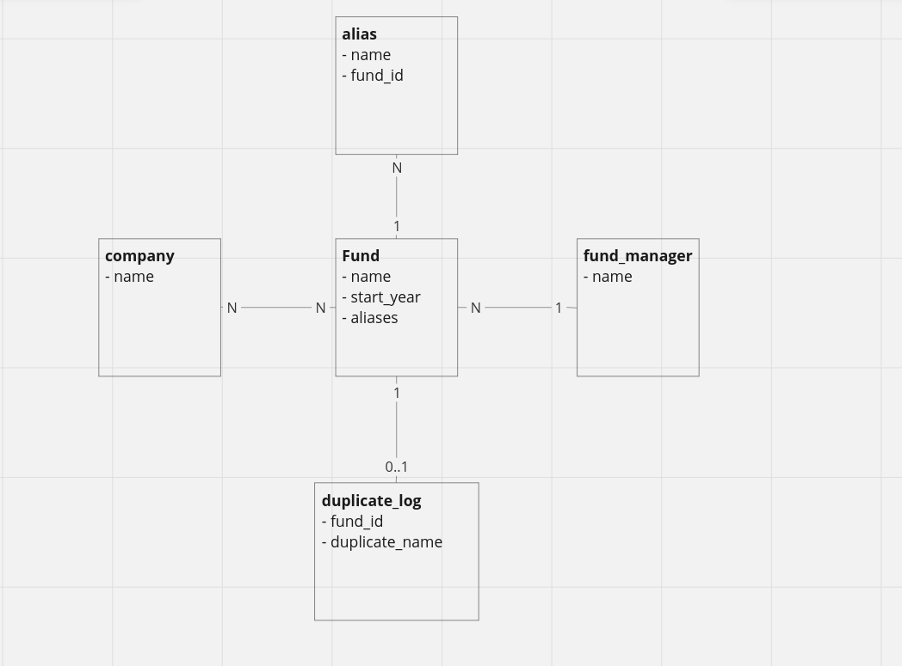

# app demo

## decisions and design

### tech stack

php 8.2, laravel, mysql

### data model



(check `docs/er.png` in case it doesn't load here)

I added two extra entities to support the app:
    
 - `alias`: simple name holder connected to the fund - a straighfoward way to allow a fund to contain multiple names in a relational model

 - `duplicate_fund_logs`: the idea there is to store a record referencing every fund that has a potential duplicate, alongside the "problematic" name. This will work essentially as a cache for retrieving data about "which funds may contain duplicates ; what are the duplicate names ; which are the duplicate name funds relationships". 

### api

`app/Http/Controllers/FundController.php`

- `list` lists existing funds, allowing you to filter them by name, manager name and year

- `update` simple fund update, any attribute (including replacing the aliases)

- `duplicates` displays all the possible recorded duplicates, grouped by the possible duplicate name: 

    - duplicate name
    - number of possible dups with the name
    - list of the funds in this duplicate group

The API has decent test coverage on `tests/Feature/FundControllerTest.php`.


The `list` and `update` endpoints return the fund, manager data and aliases data. I didn't spend much thought on what exactly would be relevant there.


### duplicate name checking / service

First of, for the purposes of this app I'm considing duplicate names exact string matches (case included). 

On `app/Models/Fund.php` we have listeners for the created and updated events on Funds an Aliases (the listeners are there for simplicity, we could easily move them to a separate folder/class with more time). 

Every time one of these events get triggered, we dispatch a queued worker job that will do the actual duplicate detection - check `app/Jobs/DuplicateChecking.php`.

If the job detects a duplicate, it'll dispatch a `DuplicateFundWarning`, which will be consumed by `app/Listeners/DuplicateFundWarningConsumer.php`. The consumer will then figure out the exact name that is a duplicate, and store the name, alongside all the relevant fund ids in a log table.

The log `DuplicateFundLog` structure serves basically as an useful "cache" of all the found logs - it facilitates retrieval of the information for future manual consolidation. The implemented solution is a very simple one, but I didn't want to speculate too much on the app usage - a proper design would need some extra context: frequency of fund creation / updating, amount of funds, how the consolidation process actually works, etc.

`tests/Unit/Models/FundTest.php` displays the duplicate dection feature working, as well as covers all the core cases.

Lastly, while the implementation makes use of the framework event system for simlpicities sake, it wouldn't be hard to move it to a proper event-broker system (g pub/sub, kafka, rabbitmq).

## scalability


### How will your application work as the data set grows increasingly larger?

for this particular toy app the bottleneck will be the name duplicate checking. Every new fund/alias will trigger a scan on all the previously existing fund and alias names. Of course, here both `name` columns are indexed, so the search time will always be `O(log n)` - i.e. not that much impact (the `duplicates` endpoint is also being grouped and counted targeting an indexed field).

a real-world app will probably require a more sophisticated name comparsion (full text search), that would complicated the querying and indexing. 

### How will your application work as the # of concurrent users grows increasingly larger?

as stated before, the main point of stress will be in the fund/alias insert/update operations.

since those are delegated to a queue worker, response times shouldn't be impacted. 

more than that, it really depends on the app usage: it might be that we need to throttle the name checking queue workers in order to reduce database I/O, but that only if the amount of operations 
gets to real extremes.

as for the GET endpoints, they are fairly simple and simple indexing of columns (like start_year) can go a long way. On extreme cases, we could start looking at some caching strategies. 


## running

you'll need composer (https://getcomposer.org/) and docker

```
composer install

docker compose up -d

docker exec -it investment-funds-demo-app-laravel.test-1 /bin/bash

vendor/bin/phpunit tests/

```

I ended up not having time to properly configure the http server for the app, so only the unit/features are available through the container (but there are tests for all endpoints).
